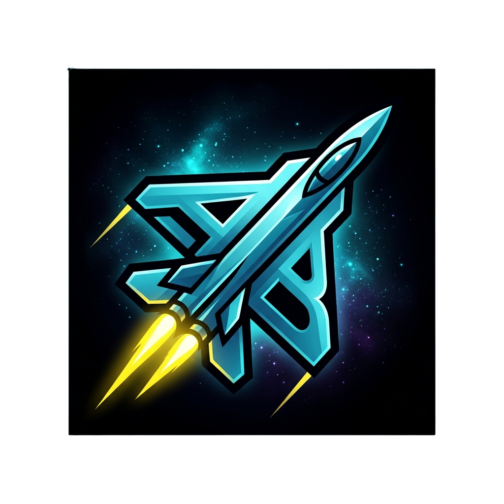
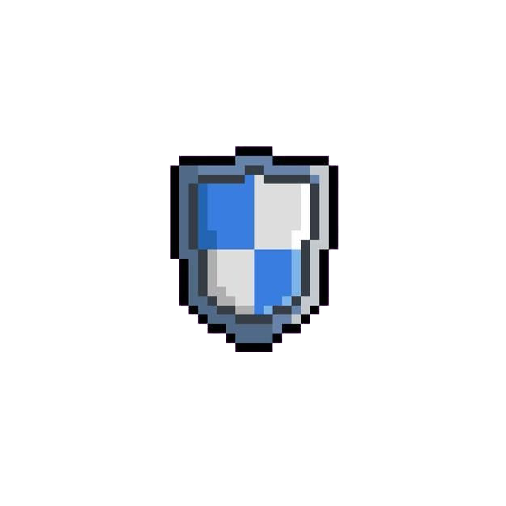

# Air Battle

### Desenvolvimento por: Santiago Fidmay

---

## 1. Identificação do Projeto

* **Título do Projeto:** Air Battle
* **Identificação do Desenvolvedor:** Santiago Fidmay
* **Logotipo/Banner:**
    

      
    

    *(Banner oficial do jogo Air Battle)*

---

## 2. Visão Geral do Sistema

### ● Descrição
**Air Battle** é um software de entretenimento digital (game) focado em ação e combate aéreo. O projeto utiliza tecnologias web puras (HTML5, CSS3 e JavaScript) para rodar diretamente no navegador, sem a necessidade de instalações.

### ● Objetivo
A finalidade do game é proporcionar uma experiência de combate aéreo estilo *arcade* (shoot 'em up horizontal), onde o jogador deve sobreviver a ondas de inimigos até enfrentar o desafio final.

### ● Tema e Objetivo do Jogo
O tema escolhido é a guerra aérea clássica combinada com elementos sci-fi na batalha final. O objetivo do jogador é controlar um caça, destruir aviões inimigos para acumular pontos e sobreviver. Ao atingir uma pontuação elevada (350 pontos em 1P ou 700 pontos em 2P), o jogador entra na fase final para enfrentar a lendária Nave Mãe Alienígena (Boss). O jogo é vencido ao derrotar o Boss.

---

## Instruções de Jogabilidade

### ● Controles
O jogo possui modos de 1 e 2 jogadores cooperativos localmente.

| Jogador | Ação | Tecla / Comando |
| :--- | :--- | :--- |
| **P1** | Mover para Cima | `W` |
| | Mover para Baixo | `S` |
| | Atirar | `Espaço` ou `Clique do Mouse` |
| **P2** | Mover para Cima | `Seta para Cima` |
| | Mover para Baixo | `Seta para Baixo` |
| | Atirar | `Enter` |

*O jogo começa em uma tela de introdução que requer um clique do mouse para iniciar a trilha sonora e acessar o menu principal.*

### ● Coletáveis (Power-ups)
Durante a batalha, itens aleatórios cairão do céu. Colete-os para ganhar vantagens temporárias:

*  **Tiro Duplo:** O avião dispara dois projéteis simultâneos por 5 segundos.
*  **Super Velocidade:** Aumenta drasticamente a velocidade de movimentação do avião por 5 segundos.
*  **Escudo de Energia:** Cria uma barreira protetora que impede o avião de tomar dano ao colidir ou ser atingido por 5 segundos.

---

## Especificações Técnicas

### ● Lógica de Progressão das Fases e Evolução
O jogo possui um sistema de progressão visual do avião do jogador baseado na pontuação acumulada:

1.  **Fase 1 (0 pts):** Caça clássico.
2.  **Fase 2 (50 pts):** Caça de guerra simples.
3.  **Fase 3 (100 pts):** Caça de guerra avançado.
4.  **Fase 4 (150 pts):** Caça stealth (SR-71).
5.  **Fase 5+ (200+ pts):** Bombardeiro B-2 Spirit.

### ● Vidas, Pontuação e Boss
* **Vidas:** O jogador (ou cada jogador no modo 2P) começa com 5 vidas. Colisões ou tiros inimigos removem 1 vida. O jogo acaba quando todas as vidas chegam a zero.
* **Pontuação:** Cada inimigo destruído concede 10 pontos. No modo 2P, a pontuação é individual, mas o total é somado para invocar o Boss.
* **Invocação do Boss:** Ao atingir a pontuação meta (350 pts em 1P ou 700 pts cooperativos em 2P), todos os inimigos menores sumirão e o Boss (Nave Mãe Alienígena) aparecerá.
* **O Boss:** A Nave Mãe Alienígena tem um comportamento de movimentação vertical, barra de vida centralizada na tela, sons únicos de tiro e o dobro de vida (800 HP) no modo de 2 jogadores. O Boss entra em modo "fúria" ao atingir 37% de vida, mudando a trilha sonora para o clima final.

---

## Créditos e Sobre

Esta seção contém os dados dos responsáveis pelo desenvolvimento e orientação do projeto.

| Função | Nome | Contato |
| :--- | :--- | :--- |
| **Desenvolvedor** | Santiago Fidmay | [santiagofidmay@gmail.com](mailto:santiagofidmay@gmail.com) |
| | | [GitHub](https://github.com/SantiagoFidmay) |
| | | [Instagram](https://www.instagram.com/santiagofidmay) |
| **Product Owner** | [Nome do Professor] | [Contato do Professor] |

---

## Link de Produção

### 🎮 [Clique aqui para jogar o Air Battle!](https://air-battle-2-d.vercel.app/)
